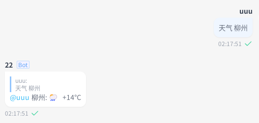
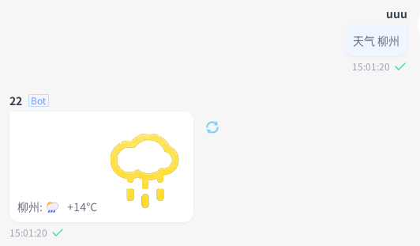

# 快速开始

:::info[开始之前]

在一切之前，默认你已经部署好一个 NoneBot2 的实例，并且已经成功运行。

> 还没有？请参考 [nOneboT的快速上手](https://nonebot.dev/docs/next/quick-start) 章节。

:::

这是一个简单的实例，展示了SAA的基础使用方法

## 安装

在这里将使用 [nb-cli](https://cli.nonebot.dev/) 来安装 SAA 插件

```bash
nb plugin install nonebot-plugin-send-anything-anywhere
```

## 示例

接下来，我们将使用 SAA 来实现一个经典的插件：[`nonebot-plugin-weather`](https://nonebot.dev/docs/next/tutorial/handler)

### 用户查询

我们假设有这样一个需求：用户输入 `天气 <城市>`，机器人将会返回该地的天气信息。

```python
from nonebot.rule import to_me
from nonebot.plugin import on_command

weather = on_command("天气", rule=to_me(), aliases={"weather", "查天气"}, priority=10, block=True)

@weather.handle()
async def get_weather():
    pass  # do something here
```

接着，插件应该去调用一个天气API，获取天气信息，然后将信息发送给用户。

然后需要将文本信息发送给用户，这里我们使用 SAA 插件来实现。

:::tip[别忘了加载插件]

在调用 SAA 插件之前，需要先 `require("nonebot_plugin_saa")`，以确保插件已经被加载。

还需要注意的是, 与安装所用的包名 `nonebot-plugin-send-anything-anywhere` 不同，这里使用的是 **`nonebot_plugin_saa`**。
:::

对于获取到的天气文本信息，需要先使用 `Text` 来包装，然后使用 `send` 来发送。

```python
from nonebot import require, on_command
from nonebot.rule import to_me
from nonebot.adapters import Message
from nonebot.params import CommandArg

require("nonebot_plugin_saa")
from nonebot_plugin_saa import Text

# 函数模拟了一个对天气API的异步请求用以演示
# 这里用一个固定的字符串返回替代请求结果
async def weather_api(city: str) -> str:
    response: str = "柳州: 🌦   +14°C"
    return response

weather = on_command("天气", rule=to_me(), aliases={"weather", "查天气"}, priority=10, block=True)

@weather.handle()
async def get_weather(args: Message = CommandArg()):
    if location := args.extract_plain_text():
        result = await weather_api(location)
        await Text(result).send()
    else:
        await Text("请输入要查询的地点").finish()
```

可能在 Bot 发送天气消息时，我们希望 Bot 能同时 `@用户`并回复

```python
# ...
@weather.handle()
async def get_weather(args: Message = CommandArg()):
    if location := args.extract_plain_text():
        result = await weather_api(location)
        await Text(result).send(at_sender=True, reply=True)
    else:
        await Text("请输入要查询的地点").finish()
```

这样，当用户输入 `天气 柳州` 时，Bot 将会回复消息，并在消息前 `@用户`



也可以进行图文混排，这个时候，我们需要使用 `Image` 来包装图片，并且使用 `MessageFactory` 来组装文本和图片。

```python
from pathlib import Path
# ...
from nonebot_plugin_saa import Text, Image, MessageFactory

assets_path = Path("/资源文件夹路径")

# ...
@weather.handle()
async def get_weather(args: Message = CommandArg()):
    if location := args.extract_plain_text():
        result = await weather_api(location)
        await MessageFactory([Text(result), Image(assets_path / "rainy.png")]).send(
            at_sender=True, reply=True
        )
    else:
        await Text("请输入要查询的地点").finish()
```



:::info[内置的消息段类型]

上文中，我们使用了 `Text` 和 `Image` 来包装文本和图片，这些都是 SAA 内置的消息段类型。

所有的消息段类型参见 [消息构建](./02-message-build.md#内置的消息段类型messagesegmentfactory) 章节。

:::

### 定时推送

另一种常见需求是用户希望 Bot 能定时向用户推送天气消息，例如每天早上 7 点通过私聊推送当天的天气。

```python
from nonebot import require, on_command
from nonebot.rule import to_me
from nonebot.adapters import Message
from nonebot.params import CommandArg

require("nonebot_plugin_saa")
from nonebot_plugin_saa import Text, SaaTarget

weather_report = on_command(
    "每日播报", rule=to_me(), aliases={"weather_report", "定时天气"}, priority=10, block=True
)

@weather_report.handle()
async def report_weather():
    pass
```

定时任务的创建和执行可以通过官方插件 [`nonebot-plugin-apscheduler`](https://nonebot.dev/docs/best-practice/scheduler) 来实现。

在这个需求中，需要发送的目标存储起来，然后在定时任务中读取并发送。

这里需要关注的是如何获取 SAA 可使用的发送目标(PlatformTarget)。

:::info[PlatformTarget?]

PlatformTarget 是 SAA 用来表示一个可发送目标的类，它记录了需要发送到的平台、目标ID等信息。

所有可用的 PlatformTarget 参见 [消息发送](./03-send.md#可用的子类) 章节。

:::

SAA 提供了一个便捷的依赖注入来获取 PlatformTarget，即 [**`SaaTarget`**](./03-send.md#saatarget)

```python
from typing import Dict, Any, Tuple, Annotated
from nonebot import require, on_command, logger
from nonebot.rule import to_me
from nonebot.adapters import Message
from nonebot.params import CommandArg, Depends

require("nonebot_plugin_saa")
require("nonebot_plugin_apscheduler")
from nonebot_plugin_apscheduler import scheduler
from nonebot_plugin_saa import Text, SaaTarget, PlatformTarget, enable_auto_select_bot

enable_auto_select_bot()

def scheduler_job_builder(location: str, target_dict: Dict[str, Any]):
    async def job():
        result = await weather_api(location)
        await Text(result).send_to(target=PlatformTarget.deserialize(target_dict))

    return job


def extract_location_and_hour(args: Message = CommandArg()):
    logger.info(f"func: {args}")
    if args:
        location, hour = args.extract_plain_text().split()
        logger.info(f"func: {location} {hour}")
        return location, hour
    return "", ""

# ...

@weather_report.handle()
async def report_weather(
    args: Annotated[Tuple[str, str], Depends(extract_location_and_hour, use_cache=False)], target: SaaTarget
):
    if not target:
        await Text("无法提取SAA Target").finish()
    location, hour = args
    if not all((location, hour)):
        await Text("请正确输入要查询的地点和小时").finish()

    scheduler.add_job(
        func=scheduler_job_builder(location, target.dict()),
        trigger="cron",
        hour=hour,
        id=f"weather_report_{'_'.join(map(str, target.dict().values()))}",
        max_instances=1,
    )
    await Text("已开启定时天气报告").send()
```

::::tip[send/send_to]

在 Bot 主动发送消息的场景中，SAA 需要使用 `send_to` 来传入 PlatformTarget。

:::warning[自动选择Bot]

在例子中我们启用了 `enable_auto_select_bot`，这样 SAA 将会自动选择一个可用的 Bot 来发送消息。
这样就无需显式获取一个 Bot 实例传入 `send_to` 了。

详细的介绍参见 [自动选择Bot](./03-send.md#发送时自动选择bot) 章节。

:::

对于用户主动触发的场景，直接使用 `send` 即可。
::::

:::info[序列化/反序列化]

例子的代码中额外使用了 `target.dict()` 和 `PlatformTarget.deserialize(target_dict)` 来演示 PlatformTarget 的[序列化和反序列化](./03-send.md#序列化与反序列化)。

:::
